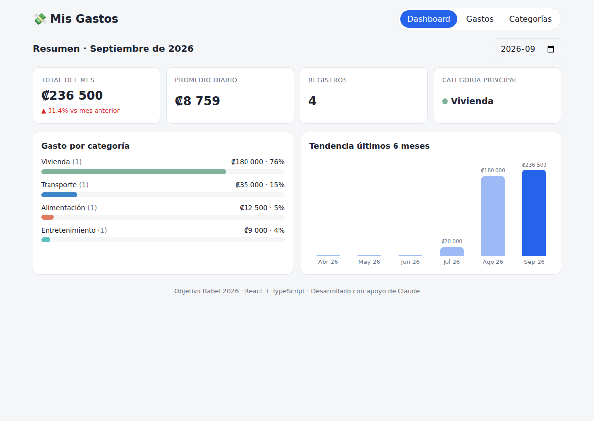
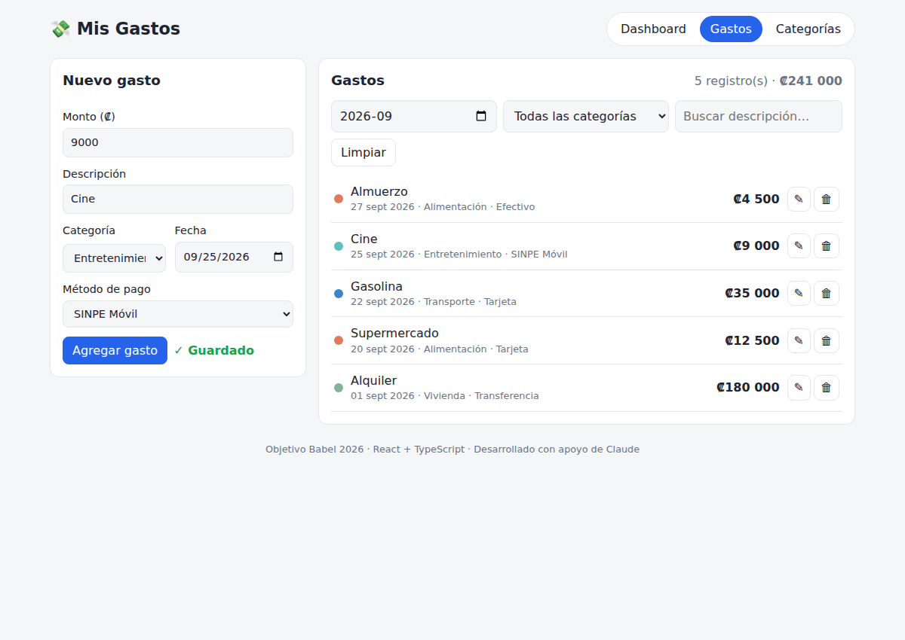
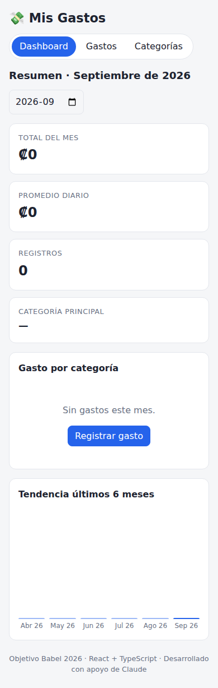

# 💸 Mis Gastos — Módulo de gestión de gastos personales

MVP en **React 19 + TypeScript + Vite** desarrollado para el Objetivo Babel 2026:
*"Desarrollar competencias en desarrollo web moderno y programación asistida por IA"*.



## Funcionalidades

- **Registro de gastos**: monto, descripción, categoría, fecha y método de pago (Tarjeta, Efectivo, SINPE Móvil, Transferencia). Crear, editar y eliminar con validación.
- **Categorías**: 8 categorías por defecto; crear, renombrar, cambiar color y eliminar (bloqueado si tiene gastos).
- **Dashboard**: total del mes y variación vs mes anterior, promedio diario, cantidad de registros, categoría principal, gasto por categoría y tendencia de 6 meses.
- **Filtros**: por mes, categoría y texto.
- **Persistencia**: `localStorage` detrás de un patrón Repository + exportar/importar respaldo JSON.

## Ejecutar

```bash
npm install
npm run dev        # http://localhost:5173
npm test           # 38 pruebas unitarias (Vitest)
npm run build      # build de producción en dist/
npm run lint       # oxlint
```

Requiere Node 20+.

## Estructura

```
src/
├── domain/       # tipos, validación, estadísticas, fechas, formato (puro, testeado)
├── data/         # Repository<T>, LocalStorageRepository, seed
├── hooks/        # useExpenseStore (useReducer + persistencia), backup
├── components/   # Dashboard, ExpenseForm, ExpenseList, FilterBar, CategoryManager, BackupControls
└── __tests__/    # Vitest
```

## Documentación (evidencias)

| Documento | Key Result |
|-----------|-----------|
| [docs/ARQUITECTURA.md](docs/ARQUITECTURA.md) — diagrama de componentes, modelo de datos, 8 ADRs, roadmap | KR1 |
| Este repositorio + historial de commits | KR2 |
| [docs/BITACORA_PROMPTS.md](docs/BITACORA_PROMPTS.md) — 10+ actividades con Claude | KR3 |
| [docs/CODE_REVIEW.md](docs/CODE_REVIEW.md) — revisión asistida y verificación | KR3 |

## Capturas

| Gastos | Móvil |
|---|---|
|  |  |
