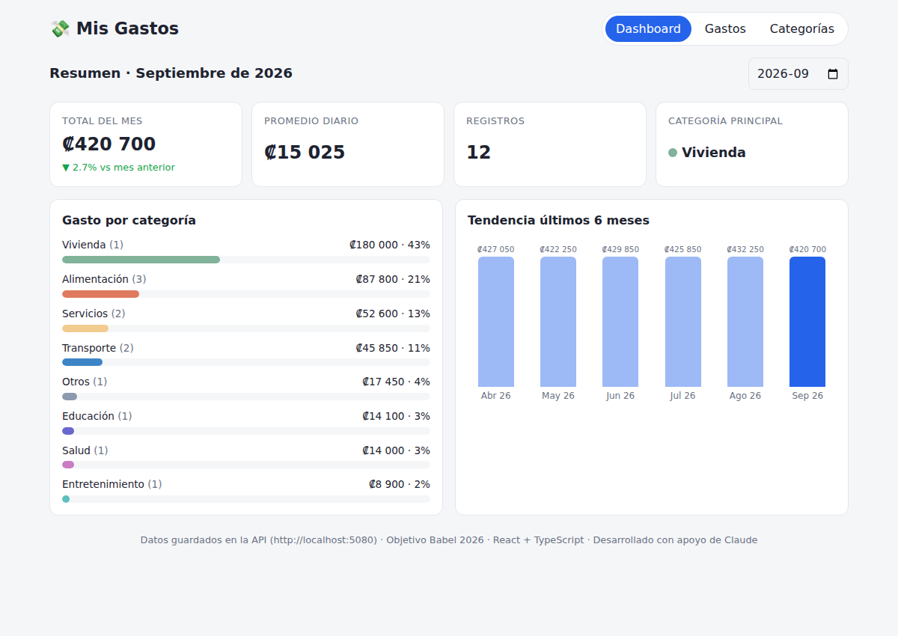

# 💸 Mis Gastos — Módulo de gestión de gastos personales

[](https://github.com/kevinsonalo/gastos-app/actions/workflows/ci.yml)

Repositorio: https://github.com/kevinsonalo/gastos-app

MVP en **React 19 + TypeScript + Vite** desarrollado para el Objetivo Babel 2026:
*"Desarrollar competencias en desarrollo web moderno y programación asistida por IA"*.


## Funcionalidades

- **Registro de gastos**: monto, descripción, categoría, fecha y método de pago (Tarjeta, Efectivo, SINPE Móvil, Transferencia). Crear, editar y eliminar con validación.
- **Categorías**: 8 categorías por defecto; crear, renombrar, cambiar color y eliminar (bloqueado si tiene gastos).
- **Dashboard**: total del mes y variación vs mes anterior, promedio diario, cantidad de registros, categoría principal, gasto por categoría y tendencia de 6 meses.
- **Filtros**: por mes, categoría y texto.
- **Persistencia**: `localStorage` por defecto, o **API .NET 10 + SQLite** ([api/](api/README.md)) con `VITE_DATA_SOURCE=api`. Exportar/importar respaldo JSON.

## Ejecutar

```bash
npm install
npm run dev        # http://localhost:5173
npm test           # 53 pruebas unitarias (Vitest)
npm run build      # build de producción en dist/
npm run lint       # oxlint
```

Requiere **Node 20.19+ o 22 LTS** (Vite 8). Con nvm-windows: `nvm install 22 && nvm use 22`.

### Con el backend .NET (prueba de datos)

Requiere el **SDK de .NET 10**.

```powershell
# Terminal 1 — API en http://localhost:5080 (crea gastos.db con 6 meses de datos de ejemplo)
dotnet run --project api/src/Gastos.Api

# Terminal 2 — frontend apuntando a la API
Copy-Item .env.example .env.local
npm run dev
```

El pie de página indica de dónde vienen los datos. Borrá `.env.local` para volver a `localStorage`.



## Estructura

Clean Architecture en cuatro capas (detalle en [docs/ARQUITECTURA.md](docs/ARQUITECTURA.md), ADR-009):

```
src/
├── domain/          # entidades, reglas de negocio, estadísticas (puro, sin React)
├── application/     # casos de uso puros, reducer y puertos (StoreGateway, IdGenerator, Clock)
├── infrastructure/  # adaptadores: localStorage, HTTP (API .NET), crypto, reloj + createDependencies()
├── presentation/    # React: componentes, useExpenseStore, formato es-CR
├── __tests__/       # Vitest, espejo por capa + prueba de arquitectura
└── main.tsx         # composition root
```

Backend en `api/` (Clean Architecture .NET): ver [api/README.md](api/README.md).

**Calidad:** `npm run check` (lint + pruebas + build) y `dotnet test api`. Ambos corren en cada push con GitHub Actions (`.github/workflows/ci.yml`).

## Documentación (evidencias)

| Documento | Key Result |
|-----------|-----------|
| [docs/ARQUITECTURA.md](docs/ARQUITECTURA.md) — diagrama de capas, modelo de datos, 11 ADRs, roadmap | KR1 |
| [github.com/kevinsonalo/gastos-app](https://github.com/kevinsonalo/gastos-app) + historial de commits | KR2 |
| [docs/BITACORA_PROMPTS.md](docs/BITACORA_PROMPTS.md) — 21 actividades con Claude | KR3 |
| [docs/CODE_REVIEW.md](docs/CODE_REVIEW.md) — revisión asistida y verificación | KR3 |
| [CLAUDE.md](CLAUDE.md) — contexto del proyecto para Claude Code (`/init`) | KR3 |
| [docs/PROYECTO.md](docs/PROYECTO.md) — ficha del proyecto y estado de KRs | Todos |
| [docs/GUIA_BUENAS_PRACTICAS.md](docs/GUIA_BUENAS_PRACTICAS.md) — estructura, patrones de diseño, convenciones y checklist | KR1 / KR3 |
| [api/README.md](api/README.md) — backend .NET 10: endpoints, estructura y patrones | KR2 / KR3 |
| [docs/MEJORES_PRACTICAS_PROMPTS.md](docs/MEJORES_PRACTICAS_PROMPTS.md) — mejores prácticas de prompts | KR3 / KR4 |

## Capturas

| Gastos | Móvil |
|---|---|
|  |  |
