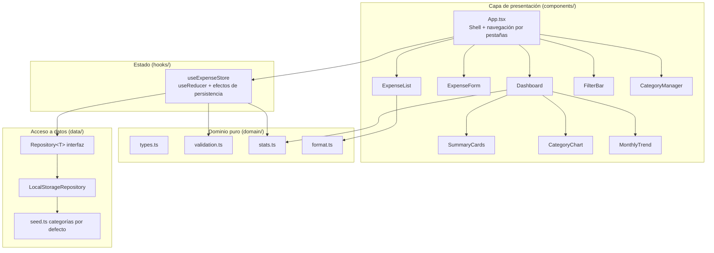
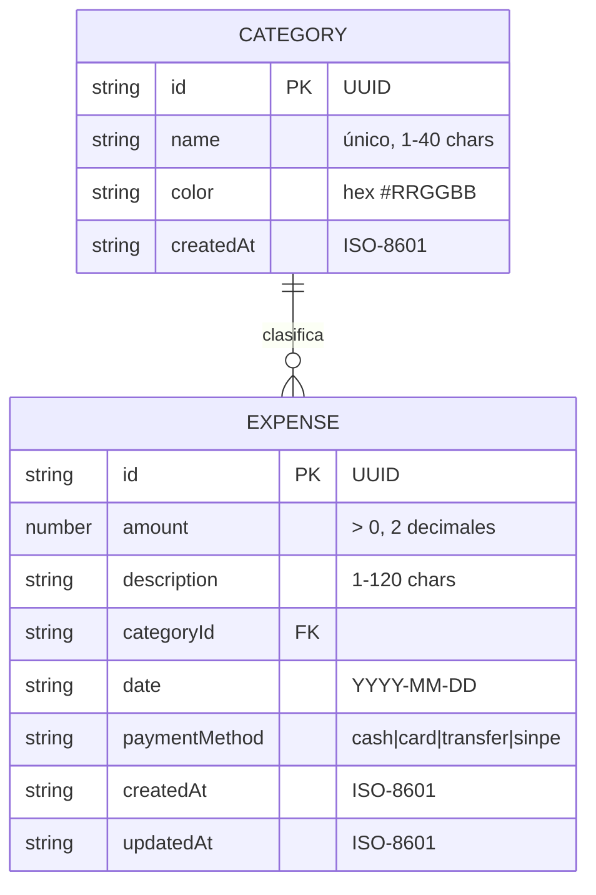

# Arquitectura — Módulo de Gestión de Gastos Personales

> Objetivo Babel 2026 · KR1: Diseño de arquitectura con Claude Code como asistente técnico.
> Autor: Kevin Solano Muñoz · Asistente: Claude (Anthropic)

## 1. Alcance del MVP

| # | Capacidad | Incluido |
|---|-----------|----------|
| 1 | Registrar, editar y eliminar gastos | ✅ |
| 2 | Gestionar categorías (crear, renombrar, color, eliminar) | ✅ |
| 3 | Dashboard básico (total del mes, promedio diario, top categoría, gasto por categoría, tendencia 6 meses) | ✅ |
| 4 | Filtros por mes, categoría y texto | ✅ |
| 5 | Persistencia de datos local (localStorage) | ✅ |
| 6 | Exportar / importar respaldo JSON | ✅ |
| — | Autenticación, multi-usuario, backend | ❌ (fase 2) |

## 2. Stack

- **React 19 + TypeScript** (modo estricto, `erasableSyntaxOnly`)
- **Vite** como bundler / dev server
- **Vitest** para pruebas unitarias
- **CSS plano** con variables (sin librería de UI) y gráficos en SVG/CSS propios → cero dependencias de runtime aparte de React.

## 3. Diagrama de componentes



**Regla de dependencias** (inspirada en Clean Architecture): `components → hooks → domain`, y `hooks → data`. El dominio no conoce React ni el almacenamiento; se prueba sin DOM.

## 4. Modelo de datos



Almacenamiento: dos claves en `localStorage`, versionadas:

| Clave | Contenido |
|-------|-----------|
| `gastos:v1:categories` | `Category[]` |
| `gastos:v1:expenses` | `Expense[]` |

## 5. Decisiones técnicas (ADR)

### ADR-001 · Frontend-only con persistencia en localStorage
- **Contexto:** El objetivo es fortalecer React + TS y entregar un MVP funcional en poco tiempo.
- **Decisión:** No incluir backend en el MVP; persistir en `localStorage`.
- **Consecuencias:** + Cero infraestructura, despliegue estático. − Datos por navegador; se mitiga con exportar/importar JSON.

### ADR-002 · Patrón Repository para aislar la persistencia
- **Decisión:** Interfaz genérica `Repository<T>` (`getAll`, `saveAll`) con implementación `LocalStorageRepository`.
- **Consecuencias:** Migrar a una API .NET (fase 2) solo requiere una nueva implementación (`HttpRepository`) sin tocar componentes.

### ADR-003 · Estado con `useReducer` en un hook dedicado, sin Redux/Zustand
- **Decisión:** `useExpenseStore` centraliza acciones (`addExpense`, `updateExpense`, `deleteExpense`, `addCategory`…) con un reducer puro y testeable.
- **Consecuencias:** Menos dependencias; el reducer se prueba como función pura. Si la app crece, se envuelve en Context.

### ADR-004 · Lógica de negocio en funciones puras (`domain/`)
- **Decisión:** Validación, agregaciones del dashboard y formato de moneda viven fuera de React.
- **Consecuencias:** Pruebas unitarias rápidas con Vitest; componentes delgados.

### ADR-005 · Montos como `number` redondeado a 2 decimales y fechas `YYYY-MM-DD`
- **Decisión:** Redondeo en validación; fechas locales como string para evitar desfases de zona horaria (UTC-6).
- **Consecuencias:** Evita el clásico bug de `new Date('2026-09-01')` interpretado en UTC → 31 de agosto.

### ADR-006 · Moneda por defecto CRC con `Intl.NumberFormat('es-CR')`
- **Decisión:** Formato local ₡; sin multimoneda en MVP.

### ADR-007 · Sin librería de gráficos
- **Decisión:** Barras horizontales CSS y columnas SVG simples.
- **Consecuencias:** Bundle pequeño; suficiente para un dashboard básico. Recharts se evaluará en fase 2.

### ADR-008 · Integridad referencial al eliminar categorías
- **Decisión:** No se permite eliminar una categoría con gastos asociados; el usuario debe reasignarlos primero.

## 6. Estructura de carpetas

```
src/
├── domain/        # tipos, validación, estadísticas, formato (puro, testeado)
├── data/          # Repository<T>, LocalStorageRepository, seed
├── hooks/         # useExpenseStore (reducer + persistencia)
├── components/    # UI
├── App.tsx
└── main.tsx
```

## 7. Roadmap (fase 2)

1. API ASP.NET Core 8 (Clean Architecture + CQRS/MediatR) con SQL Server / Azure SQL.
2. `HttpRepository` en el frontend + autenticación (Entra ID).
3. Presupuestos por categoría y alertas.
4. Importación automática desde correos de notificación bancaria.
5. Despliegue en Azure Static Web Apps con CI en GitHub Actions.
