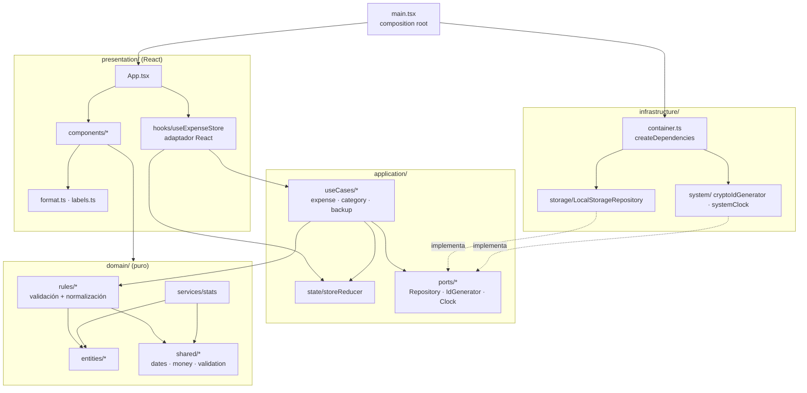
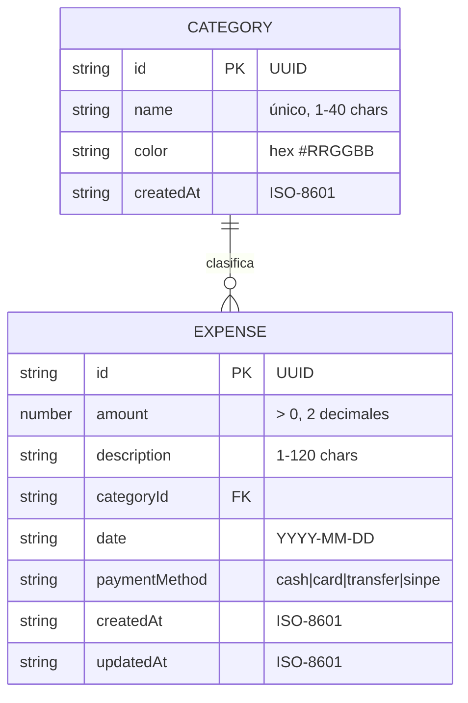

# Arquitectura — Módulo de Gestión de Gastos Personales

> Objetivo Babel 2026 · KR1: Diseño de arquitectura con Claude Code como asistente técnico.
> Autor: Kevin Solano Muñoz · Asistente: Claude (Anthropic)

## 1. Alcance del MVP

| # | Capacidad | Incluido |
|---|-----------|----------|
| 1 | Registrar, editar y eliminar gastos | ✅ |
| 2 | Gestionar categorías (crear, renombrar, color, eliminar) | ✅ |
| 3 | Dashboard básico (total del mes, promedio diario, top categoría, gasto por categoría, tendencia 6 meses) | ✅ |
| 4 | Filtros por mes, categoría y texto | ✅ |
| 5 | Persistencia de datos local (localStorage) | ✅ |
| 6 | Exportar / importar respaldo JSON | ✅ |
| — | Autenticación, multi-usuario, backend | ❌ (fase 2) |

## 2. Stack

- **React 19 + TypeScript** (modo estricto, `erasableSyntaxOnly`)
- **Vite** como bundler / dev server
- **Vitest** para pruebas unitarias
- **CSS plano** con variables (sin librería de UI) y gráficos en SVG/CSS propios → cero dependencias de runtime aparte de React.


## 3. Arquitectura en capas

La app sigue **Clean Architecture** en cuatro capas. Las dependencias apuntan siempre hacia el dominio:



| Capa | Responsabilidad | Puede importar de |
|------|-----------------|-------------------|
| `domain/` | Entidades, reglas de negocio (validación, normalización, ADR-008), estadísticas, fechas y dinero. Sin React ni I/O. | `domain` |
| `application/` | Casos de uso puros, reducer del estado y **puertos** (interfaces) hacia el exterior. | `domain` |
| `infrastructure/` | Adaptadores que implementan los puertos (`localStorage`, `crypto.randomUUID`, reloj) y `createDependencies()`. | `domain`, `application` |
| `presentation/` | React: componentes, hook adaptador y formato para pantalla (`es-CR`). | `domain`, `application` |
| `main.tsx` | Composition root: crea las dependencias concretas y las inyecta en `<App>`. | todo |

La regla se verifica automáticamente en `src/__tests__/architecture.test.ts`.

### Flujo de un comando

1. Un componente llama, p. ej., `store.addExpense(input)`.
2. `useExpenseStore` invoca el caso de uso puro `addExpense(state, input, { ids, clock })`.
3. El caso de uso valida y normaliza con reglas de dominio y devuelve una **decisión**: `{ ok: false, errors }` o `{ ok: true, action }` con la entidad ya construida.
4. Si es válida, el hook despacha la acción al `storeReducer` (que solo aplica cambios) y la persistencia ocurre en efectos que llaman a `Repository.saveAll`.

## 4. Modelo de datos



Almacenamiento: dos claves en `localStorage`, versionadas:

| Clave | Contenido |
|-------|-----------|
| `gastos:v1:categories` | `Category[]` |
| `gastos:v1:expenses` | `Expense[]` |

## 5. Decisiones técnicas (ADR)

### ADR-001 · Frontend-only con persistencia en localStorage
- **Contexto:** El objetivo es fortalecer React + TS y entregar un MVP funcional en poco tiempo.
- **Decisión:** No incluir backend en el MVP; persistir en `localStorage`.
- **Consecuencias:** + Cero infraestructura, despliegue estático. − Datos por navegador; se mitiga con exportar/importar JSON.

### ADR-002 · Patrón Repository para aislar la persistencia
- **Decisión:** Interfaz genérica `Repository<T>` (`getAll`, `saveAll`) con implementación `LocalStorageRepository`.
- **Consecuencias:** Migrar a una API .NET (fase 2) solo requiere una nueva implementación (`HttpRepository`) sin tocar componentes.

### ADR-003 · Estado con `useReducer` en un hook dedicado, sin Redux/Zustand
- **Decisión:** `useExpenseStore` centraliza acciones (`addExpense`, `updateExpense`, `deleteExpense`, `addCategory`…) con un reducer puro y testeable.
- **Consecuencias:** Menos dependencias; el reducer se prueba como función pura. Si la app crece, se envuelve en Context.

### ADR-004 · Lógica de negocio en funciones puras (`domain/`)
- **Decisión:** Validación, agregaciones del dashboard y formato de moneda viven fuera de React.
- **Consecuencias:** Pruebas unitarias rápidas con Vitest; componentes delgados.

### ADR-005 · Montos como `number` redondeado a 2 decimales y fechas `YYYY-MM-DD`
- **Decisión:** Redondeo en validación; fechas locales como string para evitar desfases de zona horaria (UTC-6).
- **Consecuencias:** Evita el clásico bug de `new Date('2026-09-01')` interpretado en UTC → 31 de agosto.

### ADR-006 · Moneda por defecto CRC con `Intl.NumberFormat('es-CR')`
- **Decisión:** Formato local ₡; sin multimoneda en MVP.

### ADR-007 · Sin librería de gráficos
- **Decisión:** Barras horizontales CSS y columnas SVG simples.
- **Consecuencias:** Bundle pequeño; suficiente para un dashboard básico. Recharts se evaluará en fase 2.

### ADR-008 · Integridad referencial al eliminar categorías
- **Decisión:** No se permite eliminar una categoría con gastos asociados; el usuario debe reasignarlos primero.


### ADR-009 · Clean Architecture en cuatro capas con casos de uso puros
- **Contexto:** El hook `useExpenseStore` mezclaba React, validación, generación de ids/fechas y reglas de negocio; el puerto `Repository` vivía junto a su implementación.
- **Decisión:** Separar `domain / application / infrastructure / presentation`. Los casos de uso son funciones puras que reciben el estado y los servicios (`IdGenerator`, `Clock`) inyectados y devuelven una acción; los puertos viven en `application/ports`; `main.tsx` es el único composition root.
- **Consecuencias:** + Casos de uso probables sin React ni mocks de tiempo; + migrar a `HttpRepository` (fase 2) solo toca `infrastructure/`; + la regla de dependencias está cubierta por una prueba. − Más archivos y un nivel extra de indirección para una app pequeña.

### ADR-010 · Textos de UI fuera del dominio y lógica de formularios en hooks
- **Contexto:** `PAYMENT_METHODS` mezclaba valores de negocio con etiquetas en español, y `ExpenseForm` combinaba estado, conversión y marcado (con un `eslint-disable` para reiniciar el estado).
- **Decisión:** el dominio expone solo los valores (`PAYMENT_METHODS` como tupla `as const`); las etiquetas viven en `presentation/labels.ts` como `Record<PaymentMethod, string>`. La lógica del formulario pasa a `useExpenseForm`, el marcado repetido a `Field`, y el reinicio se hace con `key`.
- **Consecuencias:** + el compilador exige etiqueta para cada método nuevo; + componentes más cortos y declarativos; + sin supresiones del linter. − Un archivo más por formulario.

Guía de trabajo diario (patrones, convenciones, checklist): [GUIA_BUENAS_PRACTICAS.md](GUIA_BUENAS_PRACTICAS.md).

## 6. Estructura de carpetas

```
src/
├── domain/                 # Núcleo puro: sin React ni I/O
│   ├── entities/           # Expense, Category, PaymentMethod (solo valores)
│   ├── rules/              # validar/normalizar gastos y categorías, ADR-008
│   ├── services/           # stats: filtros, totales, tendencia, resumen mensual
│   ├── shared/             # dates, money, validation
│   └── index.ts            # API pública de la capa
├── application/
│   ├── ports/              # Repository<T>, IdGenerator, Clock, AppDependencies
│   ├── state/              # StoreState, StoreAction, storeReducer, loadState
│   ├── useCases/           # expense, category, backup (funciones puras)
│   ├── result.ts           # Result / Decision
│   └── index.ts
├── infrastructure/
│   ├── storage/            # LocalStorageRepository, KeyValueStorage, seed
│   ├── system/             # cryptoIdGenerator, systemClock
│   └── container.ts        # createDependencies() / createRepositories()
├── presentation/
│   ├── components/         # UI
│   ├── hooks/              # useExpenseStore (adaptador React), useExpenseForm
│   ├── format.ts           # moneda y fechas es-CR
│   ├── labels.ts           # textos de UI para valores del dominio
│   └── App.tsx
├── __tests__/              # espejo por capa + architecture.test.ts
└── main.tsx                # composition root
```

## 7. Roadmap (fase 2)

1. API ASP.NET Core 8 (Clean Architecture + CQRS/MediatR) con SQL Server / Azure SQL.
2. `HttpRepository` en el frontend + autenticación (Entra ID).
3. Presupuestos por categoría y alertas.
4. Importación automática desde correos de notificación bancaria.
5. Despliegue en Azure Static Web Apps con CI en GitHub Actions.
